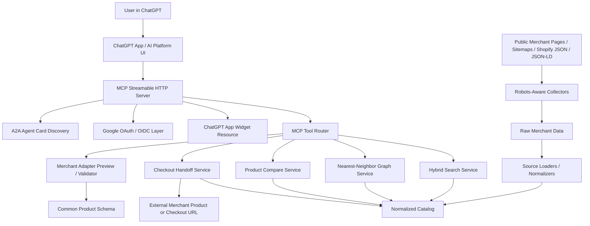

# OmniMall AI Professional Result Report

작성일: 2026-07-19

## 1. 보고서 목적

본 문서는 `README.md`의 AI Professional 과제심사형 지원서를 기준으로 OmniMall PoC의 수행 결과를 정리한 결과보고서이다.

과제명은 **"(OmniMall) ChatGPT Apps 기반 Cross-Merchant 상품 검색·추천 MCP 서버 개발"**이며, 목표는 여러 쇼핑몰의 상품 데이터를 하나의 공통 스키마로 연결하고, ChatGPT Apps SDK와 MCP 기반 대화형 쇼핑 경험을 제공하는 것이다.

본 보고서는 다음 제출 요구사항을 반영한다.

- 결과보고서: 과제 배경, 문제 정의, 수행 결과, 정량/정성 성과, 한계와 V2 계획을 문서화한다.
- 소스코드 설명: 주요 파일과 디렉터리 역할을 심사자가 빠르게 이해할 수 있도록 정리한다.
- 동작 시연 준비: 실제 입력, 처리, 결과가 보이는 시연 흐름을 제안한다.
- 시스템 구조 설명: 데이터 흐름, 주요 구성요소, 외부 연계, 인증 구조를 포함한다.

## 2. 과제 개요

OmniMall은 특정 쇼핑몰 하나에 종속되지 않는 **범용 Cross-Merchant AI Shopping MCP 서버**이다. 사용자는 ChatGPT 안에서 자연어로 상품을 검색하고, 여러 쇼핑몰의 결과를 비교하며, 유사상품 그래프를 탐색하고, 최종적으로 외부 쇼핑몰 체크아웃 링크로 이동할 수 있다.

기존 쇼핑 서비스의 문제는 쇼핑몰마다 API, 카테고리, 속성 스키마가 다르기 때문에 통합 검색과 추천을 빠르게 구축하기 어렵다는 점이다. 또한 키워드 중심 검색은 사용자의 구매 의도, 대체상품, 보완상품, 유사상품 탐색 요구를 충분히 반영하지 못한다.

OmniMall은 이 문제를 다음 방식으로 해결한다.

- 쇼핑몰별 상품 데이터를 공통 상품 스키마로 정규화한다.
- Merchant Adapter 구조로 신규 쇼핑몰 온보딩을 반복 가능한 절차로 만든다.
- 키워드, 속성, 메타데이터 품질, 재고, 그래프 신호를 결합한 하이브리드 검색을 제공한다.
- 검색 결과와 nearest-neighbor 유사상품 그래프를 ChatGPT App 위젯에서 시각화한다.
- 장바구니/체크아웃은 PoC 단계에서 외부 checkout handoff 링크와 OAuth 보호 도구로 구현한다.

## 3. 현재 구현 범위

현재 구현은 PoC 기준으로 동작 가능한 end-to-end slice를 제공한다.

| 영역 | 구현 상태 | 설명 |
| --- | --- | --- |
| MCP 서버 | 구현 | Streamable HTTP 기반 MCP endpoint `/mcp` 제공 |
| ChatGPT App 위젯 | 구현 | 상품 카드, 비교, 그래프 UI, 클릭 상세 정보 표시 |
| 공통 상품 스키마 | 구현 | merchant, product, category, price, image, rating, tags, metadata quality 정규화 |
| Merchant Adapter | 구현 | 어댑터 preview, mapping validation, source별 loader 구조 |
| 하이브리드 검색 | 구현 | 텍스트/속성/가격/재고/메타 품질/그래프 신호 기반 ranking |
| 유사상품 그래프 | 구현 | 상품 이미지를 vertex로 보여주고 relation/weight를 edge로 표시 |
| 비교 기능 | 구현 | 여러 상품의 가격, 평점, 속성, 쇼핑몰 정보를 비교 |
| OAuth 인증 | 구현 | Google OAuth/OIDC 기반 보호 도구 인증 |
| 체크아웃 연결 | PoC 구현 | 실제 결제 API가 아니라 외부 상품/checkout URL handoff |
| A2A/Provider 확장성 | 설계 및 일부 구현 | A2A agent-card endpoint와 provider-neutral MCP tool boundary 제공 |
| 실제 주문/결제 API | V2 | 제휴사 API 또는 ACP 연계 필요 |
| 실서비스 벡터 DB | V2 | 현재는 로컬 scoring/graph 기반, 외부 embedding/vector index는 후속 확장 |

## 4. 데이터 수집 및 카탈로그 현황

데이터는 merchant별 raw 파일과 normalized 파일로 분리 저장했다. 수집 시 robots policy, 공개 sitemap, 공개 product JSON, Schema.org Product JSON-LD 등 허용 가능한 공개 소스를 우선 사용했다. 차단되거나 애매한 소스는 가짜 데이터로 채우지 않고 V2 backlog에 남겼다.

| Merchant | Normalized File | Product Count | Image Count | Broad Category |
| --- | --- | ---: | ---: | --- |
| Amore Pacific | `data/amore-products.normalized.json` | 500 | 500 | beauty |
| Olive Young | `data/olive-young-products.normalized.json` | 500 | 500 | beauty |
| Lotte Hi-Mart | `data/lotte-himart-products.normalized.json` | 500 | 500 | electronics |
| Kurly | `data/kurly-products.normalized.json` | 500 | 500 | food |
| StyleKorean | `data/stylekorean-products.normalized.json` | 500 | 500 | beauty |
| Sulwhasoo US | `data/sulwhasoo-us-products.normalized.json` | 115 | 115 | beauty |
| Innisfree JP | `data/innisfree-jp-products.normalized.json` | 127 | 127 | beauty |

Runtime catalog 기준으로는 real collected products와 sample merchant products를 함께 사용한다.

- Real collected products: 2,742
- Runtime total products: 2,750
- Runtime product image URL coverage: 2,750 / 2,750
- Runtime merchants: Amore Pacific, Olive Young, Lotte Hi-Mart, Kurly, StyleKorean, Sulwhasoo US, Innisfree JP, Shinsegae, Lotte, Daiso
- Broad category coverage: beauty, food, electronics, general retail sample

## 5. 시스템 아키텍처



### 핵심 구성요소

| Component | Main Files | Role |
| --- | --- | --- |
| MCP server | `src/server.ts` | HTTP server, MCP endpoint, health check, OAuth routes |
| MCP tools | `src/mcp/tools.ts` | search, graph, compare, checkout, current user, adapter validation tools |
| Widget resource | `src/widget/html.ts`, `src/mcp/resources.ts` | ChatGPT App UI, CSP, graph-ui resource |
| Catalog/search | `src/core/catalog.ts`, `src/core/text.ts` | product loading, ranking, graph recommendations, merchant diversification |
| Checkout | `src/core/checkout.ts` | confirmation-first external checkout handoff |
| Adapter logic | `src/core/adapters.ts`, `src/core/meta.ts` | common schema mapping and metadata quality |
| Data loaders | `src/data/*.ts` | merchant-specific raw/normalized data loading |
| OAuth | `src/auth/google-oauth.ts` | Google OAuth/OIDC metadata, authorization, token, userinfo, JWKS |
| Collection scripts | `scripts/collect-merchant-products.ts`, `scripts/collect-amore-products.ts`, `scripts/lib/robots.ts` | robots-aware public product collection |
| Tests | `test/core.test.ts`, `scripts/e2e-product-test.ts`, `scripts/smoke-test.ts` | unit, E2E, smoke verification |

## 6. 데이터 흐름

1. **Source discovery**
   - Merchant별 `robots.txt`, sitemap, public product endpoint, Shopify JSON, Schema.org JSON-LD를 확인한다.
   - 허용되지 않는 checkout/cart/account/private API 영역은 수집하지 않는다.

2. **Raw collection**
   - 공개적으로 접근 가능한 상품 페이지 또는 catalog JSON에서 raw product data를 저장한다.
   - 파일 예: `data/olive-young-products.raw.json`, `data/kurly-products.raw.json`

3. **Normalization**
   - Merchant별 loader가 raw data를 공통 스키마로 변환한다.
   - 공통 필드: `merchantId`, `merchantName`, `productId`, `title`, `brand`, `domain`, `categoryPath`, `price`, `currency`, `stockStatus`, `rating`, `reviewCount`, `tags`, `productUrl`, `checkoutUrl`, `imageUrl`, `metadataQuality`

4. **Runtime catalog load**
   - MCP server 시작 시 normalized datasets를 catalog로 로드한다.
   - 실제 수집 데이터가 있는 merchant는 sample data보다 우선한다.

5. **User query and tool call**
   - 사용자가 ChatGPT에서 "여름용 선크림 추천해줘"처럼 자연어로 요청한다.
   - ChatGPT가 MCP `search_products` tool을 호출한다.

6. **Hybrid ranking**
   - 검색 엔진이 query token, merchant/category hint, price constraint, attribute match, stock status, rating/review, metadata quality를 결합해 결과를 ranking한다.
   - zero-result가 발생하면 fallback search로 유사 카테고리/속성 결과를 반환한다.

7. **Graph exploration**
   - `explore_similar_products` 또는 widget의 Similar action이 seed product를 기준으로 nearest-neighbor graph를 생성한다.
   - edge는 `similar`, `substitute`, `complement` relation과 weight/reason을 가진다.

8. **Widget rendering**
   - ChatGPT App 위젯은 product card와 graph UI를 렌더링한다.
   - graph-ui-v1/v2는 상품 이미지를 vertex로 표시하고, edge label로 관계와 가중치를 보여준다.
   - 상품 이미지/card/node 클릭 시 해당 상품 상세 정보가 표시된다.

9. **Checkout handoff**
   - 사용자가 checkout을 요청하면 `create_checkout_link` tool이 실행된다.
   - 이 tool은 Google OAuth scope `omnimall.checkout`로 보호되며, 인증 후 외부 checkout/product URL을 반환한다.

10. **Monitoring and V2 feedback**
    - collection status, product count, blocked merchant reason, test results를 문서화한다.
    - V2에서는 ranking metrics, P95 latency, conversion-related event logs를 dashboard화한다.

## 7. ChatGPT / Claude / Gemini 대응 방향

PoC의 주 시연 플랫폼은 **ChatGPT Apps SDK + MCP**가 가장 적합하다. 이유는 README의 과제명과 목표가 ChatGPT Apps 기반 MCP 서버 및 위젯 UI 구축이기 때문이다.

다만 구조는 특정 LLM SDK에 종속되지 않도록 설계했다.

| Platform | PoC Role | Current Handling |
| --- | --- | --- |
| ChatGPT / OpenAI | Primary demo platform | MCP tools, Apps widget, OAuth metadata, widget CSP |
| Claude Agent SDK | Secondary integration target | MCP-compatible tool boundary 유지 |
| Google ADK / Gemini | Secondary integration target | MCP/A2A-friendly agent boundary와 provider-neutral schemas 유지 |

즉, 시연은 ChatGPT에서 수행하고, 서버 내부는 Claude/Gemini 쪽에서도 사용할 수 있도록 tool schema와 business logic을 분리하는 방향이 맞다. 별도 frontend는 필수는 아니며, 심사용 PoC에서는 ChatGPT App 위젯 UI가 제품 화면 역할을 한다. 별도 웹 frontend는 운영 관리자, catalog QA, ranking dashboard가 필요해지는 V2 이후에 추가하는 편이 적절하다.

## 8. OAuth 및 인증 구조

OAuth는 단순히 문서 계획에만 있는 것이 아니라 현재 서버에 구현되어 있다.

지원 항목:

- OAuth protected resource metadata: `/.well-known/oauth-protected-resource/mcp`
- Authorization server metadata: `/.well-known/oauth-authorization-server`
- OpenID configuration: `/.well-known/openid-configuration`
- Dynamic client registration: `POST /register`
- Google OAuth redirect flow: `/authorize`, `/callback`
- Token exchange: `POST /token`
- JWKS: `/jwks`
- User info: `/userinfo`
- Protected tools: `create_checkout_link`, `mcp_current_user`

PoC에서는 Google OAuth를 사용한다. `search_products`, `explore_similar_products`, `compare_products`, `merchant_adapter_preview`, `validate_merchant_mapping`은 guest/public tool로 유지하고, checkout 또는 current-user처럼 사용자 식별이 필요한 action만 OAuth로 보호한다.

운영 환경에서는 다음이 필요하다.

- 안정적인 public base URL
- Google Cloud OAuth Client ID/Secret
- Google Console의 정확한 authorized redirect URI
- secret manager 또는 hosting provider 환경변수
- allowed email domain 또는 test user 정책

## 9. AI 기술 활용

현재 구현에서 AI/agentic 요소는 다음과 같이 반영된다.

- ChatGPT가 자연어 intent parsing과 tool selection을 담당한다.
- MCP tools가 구조화된 product search, graph exploration, comparison, checkout handoff를 제공한다.
- 검색 결과는 공통 상품 스키마를 기반으로 LLM이 설명하기 쉬운 structured output으로 반환된다.
- graph output은 상품 간 유사/대체/보완 관계를 명시하여 "검색 후 탐색"을 가능하게 한다.
- adapter preview/validation은 신규 merchant onboarding 시 스키마 mapping 품질을 검증하는 기반이다.

V1은 외부 embedding/vector DB 없이도 동작 가능한 PoC로 구성되어 있다. README의 embedding 기반 semantic search 목표는 V2에서 실제 embedding model, vector index, reranker, offline evaluation set과 함께 확장하는 것이 적절하다.

## 10. 평가 기준 대응

| 평가 관점 | 대응 내용 |
| --- | --- |
| 사업 유관성 | Shinsegae/Lotte/Olive Young/Amore 등 commerce 도메인의 cross-merchant search/recommendation 문제를 직접 다룸 |
| 문제 정의 명확성 | 스키마 불일치, low recall, zero-result, 약한 상품 탐색, checkout 연결 부족을 pain point로 정의 |
| 과제 완성도 | MCP 서버, ChatGPT App widget, data collection, search, graph, compare, checkout handoff, OAuth까지 end-to-end 구현 |
| 기술 활용도 | MCP, ChatGPT Apps SDK resource, OAuth/OIDC, graph recommendation, robots-aware data pipeline, common schema 적용 |
| 차별성 | 단일 쇼핑몰 chatbot이 아니라 여러 merchant를 하나의 schema와 graph UI로 묶는 구조 |
| 재현 가능성 | `npm test`, `npm run test:e2e`, `npm run smoke`로 핵심 동작 검증 가능 |
| 보안/윤리 | robots-aware collection, blocked source 미수집, checkout/account/private path 제외, OAuth-protected actions |

## 11. 검증 결과

2026-07-19 현재 checkout에서 아래 명령을 실행해 검증했다.

| Command | Result |
| --- | --- |
| `npm test` | Pass, 9 tests |
| `npm run test:e2e` | Pass |
| `npm run smoke` | Pass |

테스트에서 확인된 기능:

- cross-merchant normalized product search
- zero-result fallback
- natural language price constraint inference
- similar product graph exploration
- cross-merchant graph diversification
- product comparison
- checkout confirmation gating
- merchant adapter validation
- Google OAuth metadata exposure

## 12. 프롬프트별 UI 결과 예시

아래 예시는 심사자가 프롬프트를 실행했을 때 ChatGPT App 위젯에 어떤 화면 결과가 표시되는지 문서화한 것이다. 즉, 프롬프트 문장뿐 아니라 reviewer가 확인해야 할 UI 상태까지 함께 기록한다.

| Prompt / action | Expected UI result |
| --- | --- |
| "Search for in-stock sensitive sunscreen under 30000 KRW across multiple merchants." | 위젯 badge가 `Search`로 표시되고, `Sites shown` merchant pill이 먼저 나타난다. 이후 product image, merchant/domain, title, brand, stock, score/tags, KRW price, match reason, `Open`, `Similar`, `Checkout` button을 가진 product card grid가 표시된다. |
| "Use the best sunscreen result as the seed product and show similar products as a graph." | 위젯 badge가 `Graph`로 표시된다. graph section에는 seed product image가 중앙에 있고, 주변에 related product image node가 배치되며, edge에는 `similar`, `substitute`, `complement` relation과 weight가 표시된다. node를 클릭하면 product detail panel이 열린다. |
| "Compare the top 3 sunscreen products." | 위젯 badge가 `Compare`로 표시되고, 상품을 column으로 둔 comparison table이 렌더링된다. row에는 price, merchant, category, rating/review signal, stock, tags, metadata quality 등이 표시된다. |
| "Create a checkout link for the recommended product." | 위젯 badge가 `Checkout`으로 표시된다. 인증 전이면 ChatGPT가 Google OAuth 단계를 요청하고, 확인 및 인증 후에는 external merchant page로 이동하는 checkout handoff notice와 `Open checkout` button이 표시된다. |
| "Preview merchant adapter coverage." | 위젯 badge가 `Adapters`로 표시되고, merchant id/name, adapter status, auth profile, capabilities, catalog coverage를 담은 merchant card들이 표시된다. |
| "Validate all merchant mappings." | 위젯 badge가 `Validation`으로 표시되고, merchant별 mapping result, score, warning, onboarding estimate를 담은 validation card들이 표시된다. |
| Zero-result fallback query | 위젯은 `Search` 상태를 유지하면서 fallback notice를 보여주고, 빈 화면 대신 related alternative product card를 렌더링한다. |

이 UI 상태들은 `src/widget/html.ts`에 구현된 topbar status badge, merchant-mix pill, product-card grid, detail panel, comparison table, adapter/validation card, checkout notice, product-image graph와 대응된다.

## 13. 시연 시나리오 제안

동작 시연 영상은 심사자가 전체 시스템을 빠르게 이해할 수 있도록 다음 순서가 좋다.

1. ChatGPT에서 OmniMall App을 연결한다.
2. "Show me sunscreen products across multiple merchants" 또는 "여름용 선크림을 여러 쇼핑몰에서 추천해줘"를 입력한다.
3. 결과 카드가 Olive Young, Amore Pacific, StyleKorean 등 여러 merchant에서 나오는지 확인한다.
4. 특정 상품의 Similar 버튼을 클릭한다.
5. graph UI에서 상품 이미지 vertex와 relation edge가 표시되는지 보여준다.
6. graph node 또는 product image를 클릭하여 상세 정보 패널이 표시되는지 보여준다.
7. 여러 상품을 compare하도록 요청한다.
8. adapter preview 또는 validation tool을 실행해 신규 merchant onboarding 구조를 보여준다.

추천 테스트 프롬프트:

```text
Use OmniMall to find sunscreen products across multiple merchants. Show similar products as a graph and compare the top 3.
```

## 14. 한계 및 V2 계획

| Area | Current Limitation | V2 Plan |
| --- | --- | --- |
| Real checkout | 외부 product/checkout link handoff만 제공 | merchant cart/order API 또는 ACP 연계 |
| Embedding search | V1은 local scoring/graph 중심 | embedding model, vector DB, reranker 추가 |
| Metrics | P95/conversion/event metrics는 목표와 설계 중심 | telemetry, ranking dashboard, offline evaluation set 구현 |
| Data coverage | robots/anti-abuse로 일부 대형몰 수집 제한 | partner API/feed 또는 명시적 허가 기반 수집 |
| Admin UI | ChatGPT widget 중심 | catalog QA, adapter mapping, ranking tuning용 별도 admin frontend |
| Production OAuth | local/dev 환경 중심 | stable domain, secret manager, account policy, audit log 강화 |

## 15. 결론

OmniMall PoC는 README에서 제시한 핵심 목표인 **이기종 쇼핑몰의 공통 스키마 연결**, **상품 검색**, **유사상품 그래프 탐색**, **대화형 AI Shopping UI**, **체크아웃 연결 기반**을 전반적으로 구현했다.

심사용 관점에서 중요한 점은 단순 LLM prompt demo가 아니라, MCP server, 상품 데이터 파이프라인, graph UI, OAuth 보호 action, robots-aware collection, testable TypeScript source code가 함께 구성되어 있다는 것이다.

V1은 ChatGPT Apps 기반 시연에 집중하고, V2는 실제 merchant API/feed, embedding/vector ranking, production observability, ACP/order integration까지 확장하는 것이 가장 자연스럽다.
