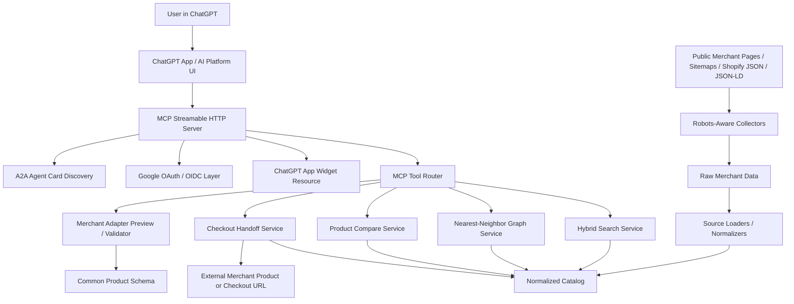

# OmniMall AI Professional Result Report

Date: 2026-07-19

## 1. Purpose

This document is the English version of the OmniMall AI Professional result report. It is based on the assignment proposal in `README.md` and the current implementation status.

The project title is **"(OmniMall) Development of a Cross-Merchant Product Search and Recommendation MCP Server Based on ChatGPT Apps"**.

The objective is to connect heterogeneous shopping mall product data through one common schema and provide an agentic conversational shopping experience through ChatGPT Apps SDK and MCP.

This report covers:

- Project background, problem definition, implementation results, and measurable outcomes.
- Source code and directory explanation for reviewers.
- System architecture, data flow, external integrations, and authentication.
- Demo scenario and prompts for showing the working PoC.
- Current limitations and V2 roadmap.

## 2. Project Overview

OmniMall is a **general-purpose cross-merchant AI shopping MCP server**. It is not limited to one merchant or one product category. A user can search products in natural language inside ChatGPT, compare results from multiple shopping sites, explore similar products through a graph UI, and move to an external merchant checkout/product page.

The core business problem is that each shopping mall has different APIs, category systems, product attributes, and metadata formats. This makes unified product search, recommendation, and merchant onboarding slow and repetitive.

Traditional keyword search also fails to capture many purchase intents. Users often need substitute products, complementary products, similar items, price-filtered results, and cross-merchant comparison paths after the first search result.

OmniMall addresses this by:

- Normalizing merchant product data into one common product schema.
- Using a Merchant Adapter pattern so new merchants can be onboarded repeatedly.
- Combining keyword, attribute, price, stock, metadata quality, and graph signals for hybrid ranking.
- Rendering product search results and nearest-neighbor graph exploration inside a ChatGPT App widget.
- Supporting checkout handoff through external product/checkout links, protected by OAuth where user identity is required.

## 3. Current Implementation Scope

The current version implements a working end-to-end PoC slice.

| Area | Status | Description |
| --- | --- | --- |
| MCP server | Implemented | Streamable HTTP MCP endpoint at `/mcp` |
| ChatGPT App widget | Implemented | Product cards, comparison, graph UI, clickable detail view |
| Common product schema | Implemented | Normalized merchant, product, category, price, image, rating, tags, metadata quality |
| Merchant Adapter | Implemented | Adapter preview, mapping validation, source-specific loaders |
| Hybrid search | Implemented | Ranking based on text, attributes, price, stock, metadata quality, and graph signals |
| Similar-product graph | Implemented | Product images are rendered as graph vertices; relation/weight are rendered as edges |
| Product comparison | Implemented | Compares price, rating, attributes, and merchant information |
| OAuth authentication | Implemented | Google OAuth/OIDC-backed authentication for protected tools |
| Checkout handoff | PoC implemented | External product/checkout URL handoff, not direct payment API |
| A2A/provider extensibility | Designed and partially implemented | A2A agent-card endpoint and provider-neutral MCP tool boundary |
| Real order/payment API | V2 | Requires merchant API, partner feed, or ACP integration |
| Production vector database | V2 | Current version uses local scoring/graph logic; external embeddings/vector index can be added later |

## 4. Data Collection and Catalog Status

Product data is saved separately per merchant as raw and normalized files. Collection prioritizes allowed public sources such as `robots.txt`, public sitemaps, public product JSON, Shopify product JSON, and Schema.org Product JSON-LD.

Blocked or ambiguous merchants were not filled with synthetic data. They are recorded in the V2 backlog instead.

| Merchant | Normalized File | Product Count | Image Count | Broad Category |
| --- | --- | ---: | ---: | --- |
| Amore Pacific | `data/amore-products.normalized.json` | 500 | 500 | beauty |
| Olive Young | `data/olive-young-products.normalized.json` | 500 | 500 | beauty |
| Lotte Hi-Mart | `data/lotte-himart-products.normalized.json` | 500 | 500 | electronics |
| Kurly | `data/kurly-products.normalized.json` | 500 | 500 | food |
| StyleKorean | `data/stylekorean-products.normalized.json` | 500 | 500 | beauty |
| Sulwhasoo US | `data/sulwhasoo-us-products.normalized.json` | 115 | 115 | beauty |
| Innisfree JP | `data/innisfree-jp-products.normalized.json` | 127 | 127 | beauty |

Runtime catalog summary:

- Real collected products: 2,742
- Runtime total products: 2,750
- Runtime product image coverage: 2,750 / 2,750
- Runtime merchants: Amore Pacific, Olive Young, Lotte Hi-Mart, Kurly, StyleKorean, Sulwhasoo US, Innisfree JP, Shinsegae, Lotte, Daiso
- Broad category coverage: beauty, food, electronics, and general retail samples

## 5. System Architecture



### Key Components

| Component | Main Files | Role |
| --- | --- | --- |
| MCP server | `src/server.ts` | HTTP server, MCP endpoint, health check, OAuth routes |
| MCP tools | `src/mcp/tools.ts` | Search, graph, compare, checkout, current user, adapter validation |
| Widget resource | `src/widget/html.ts`, `src/mcp/resources.ts` | ChatGPT App UI, CSP, graph UI resource |
| Catalog/search | `src/core/catalog.ts`, `src/core/text.ts` | Product loading, ranking, graph recommendations, merchant diversification |
| Checkout | `src/core/checkout.ts` | Confirmation-first external checkout handoff |
| Adapter logic | `src/core/adapters.ts`, `src/core/meta.ts` | Common schema mapping and metadata quality |
| Data loaders | `src/data/*.ts` | Merchant-specific raw/normalized data loading |
| OAuth | `src/auth/google-oauth.ts` | Google OAuth/OIDC metadata, authorization, token, userinfo, JWKS |
| Collection scripts | `scripts/collect-merchant-products.ts`, `scripts/collect-amore-products.ts`, `scripts/lib/robots.ts` | Robots-aware public product collection |
| Tests | `test/core.test.ts`, `scripts/e2e-product-test.ts`, `scripts/smoke-test.ts` | Unit, E2E, and smoke verification |

## 6. Data Flow

1. **Source discovery**
   - Check each merchant's `robots.txt`, sitemap, public product endpoint, Shopify JSON, or Schema.org JSON-LD.
   - Do not collect checkout, cart, account, payment, or private API paths.

2. **Raw collection**
   - Save public product data into merchant-specific raw files.
   - Examples: `data/olive-young-products.raw.json`, `data/kurly-products.raw.json`

3. **Normalization**
   - Merchant-specific loaders transform raw data into a common schema.
   - Common fields include `merchantId`, `merchantName`, `productId`, `title`, `brand`, `domain`, `categoryPath`, `price`, `currency`, `stockStatus`, `rating`, `reviewCount`, `tags`, `productUrl`, `checkoutUrl`, `imageUrl`, and `metadataQuality`.

4. **Runtime catalog load**
   - When the MCP server starts, normalized datasets are loaded into the runtime catalog.
   - Real collected datasets replace sample products for the same merchant.

5. **User query and tool call**
   - The user asks ChatGPT a natural-language shopping request.
   - ChatGPT calls an MCP tool such as `search_products`.

6. **Hybrid ranking**
   - The search service combines query tokens, merchant/category hints, price constraints, attribute match, stock status, rating/review data, and metadata quality.
   - If there are no exact results, zero-result fallback returns related products.

7. **Graph exploration**
   - `explore_similar_products` or the widget's Similar action creates a nearest-neighbor graph from a seed product.
   - Edges carry relation types such as `similar`, `substitute`, or `complement`, plus weight and reason.

8. **Widget rendering**
   - The ChatGPT App widget renders product cards and the graph UI.
   - The graph UI shows product images as vertices and relation/weight as edge labels.
   - Clicking a product image, card, or graph node opens the product detail view.

9. **Checkout handoff**
   - When the user asks for checkout, `create_checkout_link` runs.
   - This tool is protected by the OAuth scope `omnimall.checkout`.
   - After authentication, the server returns an external merchant product/checkout URL.

10. **Monitoring and V2 feedback**
    - Collection status, blocked source reasons, product counts, and test results are documented.
    - V2 should add ranking metrics, P95 latency tracking, conversion events, and a monitoring dashboard.

## 7. ChatGPT / Claude / Gemini Strategy

The primary PoC demonstration platform should be **ChatGPT Apps SDK + MCP** because the original project scope specifically targets ChatGPT Apps-based MCP and widget UI.

However, the internal design is not locked to one model provider.

| Platform | PoC Role | Current Handling |
| --- | --- | --- |
| ChatGPT / OpenAI | Primary demo platform | MCP tools, Apps widget, OAuth metadata, widget CSP |
| Claude Agent SDK | Secondary integration target | MCP-compatible tool boundary |
| Google ADK / Gemini | Secondary integration target | MCP/A2A-friendly agent boundary and provider-neutral schemas |

For the PoC, a separate frontend is not required. The ChatGPT App widget acts as the product UI. A separate frontend would make sense in V2 for admin workflows such as catalog QA, adapter mapping, ranking tuning, and analytics dashboards.

## 8. OAuth and Authentication

OAuth is implemented in the server, not only planned.

Supported endpoints:

- OAuth protected resource metadata: `/.well-known/oauth-protected-resource/mcp`
- Authorization server metadata: `/.well-known/oauth-authorization-server`
- OpenID configuration: `/.well-known/openid-configuration`
- Dynamic client registration: `POST /register`
- Google OAuth redirect flow: `/authorize`, `/callback`
- Token exchange: `POST /token`
- JWKS: `/jwks`
- User info: `/userinfo`
- Protected tools: `create_checkout_link`, `mcp_current_user`

The PoC uses Google OAuth. Public discovery and shopping tools remain available without login:

- `search_products`
- `explore_similar_products`
- `compare_products`
- `merchant_adapter_preview`
- `validate_merchant_mapping`

User-sensitive tools require OAuth:

- `create_checkout_link`
- `mcp_current_user`

For production deployment, the system needs:

- A stable public base URL.
- Google Cloud OAuth Client ID and Client Secret.
- Exact authorized redirect URI in Google Cloud Console.
- Secret manager or hosting-provider environment variables.
- Allowed email domain or test-user policy.

## 9. AI Technology Usage

The current implementation uses AI/agentic architecture in the following ways:

- ChatGPT handles natural-language intent interpretation and tool selection.
- MCP tools provide structured product search, graph exploration, comparison, and checkout handoff.
- Search results are returned as structured data that an LLM can explain clearly.
- Graph output makes product similarity, substitution, and complement relationships explicit.
- Adapter preview/validation supports repeatable merchant onboarding and schema-mapping quality checks.

V1 is intentionally built as a working PoC without requiring an external vector database. The README goal of embedding-based semantic search can be expanded in V2 with an embedding model, vector index, reranker, and offline evaluation set.

## 10. Evaluation Criteria Alignment

| Evaluation Area | How OmniMall Addresses It |
| --- | --- |
| Business relevance | Directly targets cross-merchant commerce search/recommendation for Shinsegae, Lotte, Olive Young, Amore, and similar retailers |
| Clear problem definition | Defines schema mismatch, low recall, zero-result queries, weak product exploration, and missing checkout connection |
| Implementation completeness | Implements MCP server, ChatGPT App widget, data pipeline, search, graph, compare, checkout handoff, and OAuth |
| Technology usage | Uses MCP, ChatGPT Apps SDK resources, OAuth/OIDC, graph recommendation, robots-aware data pipeline, and common schema |
| Differentiation | Connects multiple merchants into one schema and graph UI instead of building a single-merchant chatbot |
| Reproducibility | Core behavior can be verified with `npm test`, `npm run test:e2e`, and `npm run smoke` |
| Security and ethics | Uses robots-aware collection, does not fake blocked sources, excludes private/checkout/account/payment paths, and protects sensitive actions with OAuth |

## 11. Verification Results

The following commands were run successfully on 2026-07-19.

| Command | Result |
| --- | --- |
| `npm test` | Passed, 9 tests |
| `npm run test:e2e` | Passed |
| `npm run smoke` | Passed |

Verified behavior includes:

- Cross-merchant normalized product search.
- Zero-result fallback.
- Natural-language price constraint inference.
- Similar-product graph exploration.
- Cross-merchant graph diversification.
- Product comparison.
- Checkout confirmation gating.
- Merchant adapter validation.
- Google OAuth metadata exposure.

## 12. Prompt-Based UI Result Examples

The following examples document what the ChatGPT App widget should visibly render for reviewer prompts. They are included so the evaluation report shows not only the prompt text, but also the expected UI result.

| Prompt / action | Expected UI result |
| --- | --- |
| "Search for in-stock sensitive sunscreen under 30000 KRW across multiple merchants." | The widget badge shows `Search`, followed by `Sites shown` merchant pills. Product cards appear in a grid with product images, merchant/domain, title, brand, stock, score/tags, KRW price, match reasons, and `Open`, `Similar`, and `Checkout` buttons. |
| "Use the best sunscreen result as the seed product and show similar products as a graph." | The widget badge shows `Graph`. A graph section renders the seed product image in the center, related product-image nodes around it, relation lines labeled `similar`, `substitute`, or `complement` with weights, and a legend. Clicking a node opens the product detail panel. |
| "Compare the top 3 sunscreen products." | The widget badge shows `Compare`. A comparison table appears with products as columns and fields such as price, merchant, category, rating/review signal, stock, tags, and metadata quality as rows. |
| "Create a checkout link for the recommended product." | The widget badge shows `Checkout`. If the user is not authenticated, ChatGPT requests Google OAuth. After confirmation and authentication, the widget shows a checkout handoff notice and an `Open checkout` button for the external merchant page. |
| "Preview merchant adapter coverage." | The widget badge shows `Adapters`. Merchant cards list merchant id/name, adapter status, auth profile, capabilities, and catalog coverage. |
| "Validate all merchant mappings." | The widget badge shows `Validation`. Validation cards show each merchant's mapping result, score, warnings if any, and onboarding estimate. |
| Zero-result fallback query | The widget remains in `Search` mode, shows a fallback notice, and still renders related alternative product cards instead of an empty result page. |

These UI states correspond to the implemented widget in `src/widget/html.ts`: topbar status badge, merchant-mix pills, product-card grid, detail panel, comparison table, adapter/validation cards, checkout notice, and product-image graph.

## 13. Demo Scenario

A review/demo video should show input, processing, and output clearly.

Recommended flow:

1. Connect the OmniMall App inside ChatGPT.
2. Ask: "Show me sunscreen products across multiple merchants."
3. Confirm that results come from multiple merchants such as Olive Young, Amore Pacific, and StyleKorean.
4. Click the Similar button for one product.
5. Show the graph UI with product-image vertices and relation edges.
6. Click a graph node or product image to open the detail panel.
7. Ask ChatGPT to compare the top 3 products.
8. Run adapter preview or validation to show the merchant onboarding structure.

Recommended test prompts:

```text
Use OmniMall to find sunscreen products across multiple merchants. Show similar products as a graph and compare the top 3.
```

## 14. Limitations and V2 Plan

| Area | Current Limitation | V2 Plan |
| --- | --- | --- |
| Real checkout | Only external product/checkout link handoff is provided | Add merchant cart/order API or ACP integration |
| Embedding search | V1 uses local scoring and graph logic | Add embedding model, vector database, and reranker |
| Metrics | P95/conversion/event metrics are planned but not fully instrumented | Add telemetry, ranking dashboard, and offline evaluation set |
| Data coverage | Some large marketplaces are blocked by robots policy or anti-abuse responses | Use partner API/feed or explicit permission |
| Admin UI | ChatGPT widget is the primary UI | Add admin frontend for catalog QA, adapter mapping, and ranking tuning |
| Production OAuth | Current setup is local/dev oriented | Use stable domain, secret manager, account policy, and persistent audit logs |

## 15. Conclusion

OmniMall PoC broadly satisfies the core goals in the original README:

- Connecting heterogeneous shopping mall data into one common schema.
- Product search across multiple merchants.
- Similar-product graph exploration.
- Conversational AI shopping through ChatGPT App UI.
- Checkout handoff with OAuth-protected user-sensitive actions.

The important point for evaluation is that this is not just an LLM prompt demo. It includes a working MCP server, product data pipeline, graph UI, OAuth-protected actions, robots-aware collection, testable TypeScript source code, and documentation for future development.

V1 should be demonstrated through ChatGPT Apps SDK and MCP. V2 should extend the platform with partner merchant APIs, embedding/vector ranking, production observability, and ACP/order integration.
